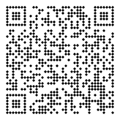

<div align="center">
  <h1 align="center"><b>mdbook-qr</b></h1>
</div>

<p align="center">
  <a href="https://crates.io/crates/mdbook-qr">
    
  </a>
  <a href="https://crates.io/crates/mdbook-qr">
    
  </a>
  <a href="https://docs.rs/mdbook-qr">
    
  </a>
  <a href="https://github.com/CompEng0001/mdbook-qr/actions">
    
  </a>
  
</p>

An <a href="https://github.com/rust-lang/mdBook">mdBook</a> preprocessor that generates and embeds a QR code for your book, powered by <a href="https://docs.rs/fast-qr">fast-qr</a>. Since mdbook is mobile-friendly, a QR code makes it easy to access the book quickly on a mobile device.
It produces a PNG image during the build and replaces {{QR_CODE}} markers in chapters with an  tag pointing to the generated QR code.


---

## Features

- Generates a **PNG QR code** using <code>fast-qr</code>.
- Inserts the image automatically wherever `{{QR_CODE}}` appears.
- Supports module **shapes** (see [shapes](#shapes)) .
- Adjustable **quiet zone margin** and **RGB\<A\> colors**.
- Optional **fit width/height** for injected `` tags.
- **Idempotent**: reuses identical images to avoid triggering rebuild loops.
- Defaults to `site-url` when no URL is set.
- Fully compatible with **mdBook 0.4.x**.

---

## Installation

From crates.io:

```sh
cargo install mdbook-qr
```

From source (in this repo):

```sh
cargo install --path .
```

Ensure the `mdbook-qr` binary is on your `PATH`.

---

## Quick start

In your `book.toml`:

```toml
[preprocessor.qr]
enable = true
url = "https://example.com"
qr-path = "src/qr.png"
margin = 4
background = "#FFFFFFFF"
module =  "#000000FF"
shape.cirle = true

[preprocessor.qr.fit]
width = 256
height = 256

[preprocessor.qr.shape]
circle = true
```

Then, in any chapter Markdown file, add the marker:

```md
{{QR_CODE}}
```

On build, it becomes:

```html

```

---

## Configuration overview

All options are read from `[preprocessor.qr]` and sub-tables.

| Key | Type | Description | Default |
|-----|------|--------------|----------|
| `enable` | bool | Enables or disables the preprocessor | `true` |
| `url` | string | The URL or text to encode | *(required)* |
| `qr-path` | string | Relative path to the output PNG, absolute path is resolved automatically | `"src/mdbook-qr-code.png"` |
| `margin` | integer | Quiet zone around the QR (in modules) | `2` |
| `shape` | table | Boolean flags defining the QR module shape (see below) | `{ square = true }` |
| `background`  | string | Hex represenation of color, can have alpha| `"#BBBB1222"` or `[187, 187, 18, 133]` | 
| `module`  | string | Hex represenation of color, can have alpha| `"#FFFFFFFF"` or `[255, 255, 255, 255]` | 
| `shape`| bool |

### Fit (image size)

```toml
[preprocessor.qr.fit]
width = 200
height = 200
```
If only one dimension is given, it is mirrored for the other.

### Shape

```toml
[preprocessor.qr.shape]
square = true
circle = true        # supersedes square as it overides square
rounded_square = true
vertical = true
horizontal = true
diamond = true
```
Heirarchy:
- `square` is default if none supplied
- Then precedence (first `true` wins):  
  - **circle → rounded_square → vertical → horizontal → diamond → sqaure**

>[!NOTE]
> `mdbook-qr` has not implemented `fast_qr::convert::Shape::Command` for custom shapes. 

---

## URL resolution

If `url` is omitted, it is resolved automatically from:

- GitHub Actions `env` variable `GITHUB_REPOSITORY` →` https://{owner}.github.io/{repo}` (useful in CI/CD builds)

---

## Example outputs

  

```html

```
---

## Compatibility

- Tested with **mdBook 0.4.x**
- Renderer support: **html**
- Requires Rust 1.70 or newer

---

## License

[MIT](LICENSE.md)

---

## Author

[CompEng0001](https://github.com/CompEng0001)
