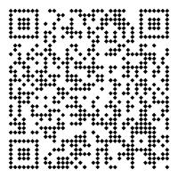

# Documentation


## 1. Configuration Overview

All options are read from `[preprocessor.qr]` and its sub-tables.

| Key | Type | Description | Default |
|-----|------|--------------|----------|
| `enable` | bool | Enable or disable the preprocessor | `true` |
| `localhost-qr` | bool | For UX proposes you generate a placeholder qr code from localhost | `false` |
| `marker` | string | the marker where `` is injectd| `{{QR_CODE}}`|
| `url` | string | The URL or text to encode | `GITHUB_REPOSITORY` |
| `qr-path` | string | Relative or absolute path to the output PNG | `"qr/mdbook-qr-code.png"` |
| `margin` | integer | Quiet zone around the QR code (in modules) | `2` |
| `fit`    | integer | Size/dimension of the QR code image|`width = 200`|
| `background` | string | Hex color (`#RRGGBBAA`,`#RRGGBB`,`[RRR,GGG,BBB,AAA]`,`[RRR,GGG,BBB]` supported) | `"#FFFFFFFF"` |
| `module` | string | Hex color (`#RRGGBBAA`,`#RRGGBB`,`[RRR,GGG,BBB,AAA]`,`[RRR,GGG,BBB]` supported) | `"#000000FF"`  |
| `shape` | table | Boolean flags defining the QR module shape | `square = true` |

<br>

### 1.1 Localhost QR

*new for v0.1.3*

When building locally with `mdbook serve`, you can enable a development-only QR mode that points to your local preview server instead of the deployed GitHub Pages site.

```toml
[preprocessor.qr]
enable = true
localhost-qr = true
```

When `localhost-qr = true`:

- All generated QR codes encode `http://127.0.0.1:3000/` (the default mdbook serve address).

- The image is written to a fixed, predictable path, `{book.src}/mdbook-qr/qr_localhost.png`

- The preprocessor automatically creates or updates your repository's `.gitignore` with `{book.src}/mdbook-qr/` ensuring the development image is never committed to Git.

- CI/CD or production builds use normal behaviour, see [URL Resolution](#13-url-resolution) section for more details.


> [!TIP]
> This mode provides a seamless local preview experience while keeping your repository clean.
> For example, `mdbook serve` at `http://127.0.0.1:3000/` will display valid QR codes pointing to your local preview pages.

### 1.2 Marker

The `marker` where `` is injectd

- Default for non-custom markers

  - `{{QR_CODE}}`

> [!IMPORTANT]
> - `marker` is defaulted to `{{QR_CODE}}` and cannot explicitly be set to anything else. If you want to use your marker then create a `custom.*` sub-table, see [Custom Configurations](#2-custom-configurations) section.

### 1.3 URL Resolution

If `url` is omitted, and you are in CI environment `mdbook-qr` resolves it automatically from GitHub Actions environment variable `GITHUB_REPOSITORY`, producing:  
  
  - `https://{owner}.github.io/{repo}`

If you are local enable the `localhost-qr` option, see [Localhost QR](#11-localhost-qr) section for me information.

```toml
[preprocessor.qr]
url = "https://compeng0001.github.io/mdbook-qr"
```

> [!NOTE]
> You can always set an env variable locally to test CI
> - `export GITHUB_REPOSITORY="owner/repo"`
>    
> To `unset`
> - `unset GITHUB_REPOSITORY`

### 1.4 QR Path

`qr-path` can be relative or absolute path to the output PNG.

- Default path if none is provided for non-custom marker is
  - `src_dir/src/qr/qr_code.png`, where `src_dir` is `book.src` declared in book.toml

```toml
[preprocessor.qr]
qr-path = "/path/to/qr_code.png
```

### 1.5 Margin

Quiet zone around the QR code (in modules)

```toml
[preprocessor.qr]
margin = 2
```

### 1.6 Fit (Image Size)

`fit` can be used to specify the size/dimensions of the qr code. The default is `fit.width = 200` which is mirrored to `fit.height = 200`

```toml
[preprocessor.qr.fit]
width = 300
height = 300
```

If only one dimension is provided, the same value is used for the other.


### 1.7 Background

The colour of the background for the qr code:

  - Hex color:
    -  `#RRGGBB`
    -  `#RRGGBBAA`
  - RGB:
    - `[RRR,GGG,BBB]`
    - `[RRR,GGG,BBB,AAA]`

```toml
[preprocessor.qr]
background = "#FFFFFF"
```

### 1.8 Module

The colour of the module for the qr code:

  - Hex color:
    -  `#RRGGBB`
    -  `#RRGGBBAA`
  - RGB:
    - `[RRR,GGG,BBB]`
    - `[RRR,GGG,BBB,AAA]`

```toml
[preprocessor.qr]
module = "#000000"
```

### 1.9 Shape

Boolean flags defining the QR module shape

```toml
[preprocessor.qr.shape]
square = true
circle = true
rounded_square = true
vertical = true
horizontal = true
diamond = true
```

> [!NOTE]  
> **Shape Precedence (first `true` wins):**
>   - circle -> rounded_square -> vertical -> horizontal -> diamond -> square`
> 
>   - If none are supplied, **square** is used.
> 
> `fast_qr::convert::Shape::Command` (for custom procedural shapes) is not yet implemented.


## 2. Custom Configurations

Custom QR definitions allow you to create **named styles** that inherit values from the main `[preprocessor.qr]` table.  

These are declared under `[preprocessor.qr.custom.*]` as a sub-table.

Each named sub-table inherits **all** parent values unless explicitly overridden, **accept** `marker` and `qr-path` see following sub-sections for guidance.

```toml
[preprocessor.qr]
url = "https://default.example.com"
margin = 2
background = "#FFFFFFFF"
module = "#000000FF"

[preprocessor.qr.custom.footer]
marker = "{{QR_FOOTER}}"
url = "https://github.com/CompEng0001"
qr-path = "src/footer-qr.png"
fit.width = 128
fit.height = 128
shape.diamond = true

[preprocessor.qr.custom.slide]
marker = "{{QR_SLIDE}}"
url = "https://slides.example.com"
module = "#22AAFFFF"
background = "#00000000"
shape.circle = true
```

### 2.1 Custom Marker

Each marker corresponds to its respective `[preprocessor.qr.custom.*]` sub-table. 

```toml
[preprocessor.qr.custom.slide]
marker = "{{QR_SLIDE}}"

[preprocessor.qr.custom.footer]
marker = "{{QR_FOOTER}}"
```

Based on the configuration in above you would use these markers in your Markdown files:

```md
{{QR_FOOTER}}
{{QR_SLIDE}}
```

Each marker corresponds to its respective `[preprocessor.qr.custom.*]` block.  

> [!IMPORTANT]
> - The `custom.*` sub-table only generates a QR code when the `marker` is defined and placed in a Markdown file(s)

### 2.2 Custom QR Path

The `custom.*.qr-path` can be defined by the user and the `*.png` will be created there.

```
[preprocessor.qr.custom.example]
marker = "{{QR_EXAMPLE}}"
```

> [!IMPORTANT]
> If custom marker is defined and no path given then default path is used and file name is derived from marker:
> - Using example from above - `src_dir/qr/qr_example.png`, 
>    - where `src_dir` is `book.src` declared in book.toml
---

## 3. Example Outputs

```toml
[preprocessor.qr]
url = "https://default.example.com"
margin = 2
background = "#FFFFFFFF"
module = "#000000FF"

[preprocessor.qr.custom.footer]
marker = "{{QR_FOOTER}}"
url = "https://github.com/CompEng0001"
qr-path = "src/footer-qr.png"
fit.width = 128
fit.height = 128
shape.diamond = true

[preprocessor.qr.custom.slide]
marker = "{{QR_SLIDE}}"
url = "https://slides.example.com"
module = "#22AAFFFF"
background = "#00000000"
shape.circle = true

```

<div align=center>

  

</div>